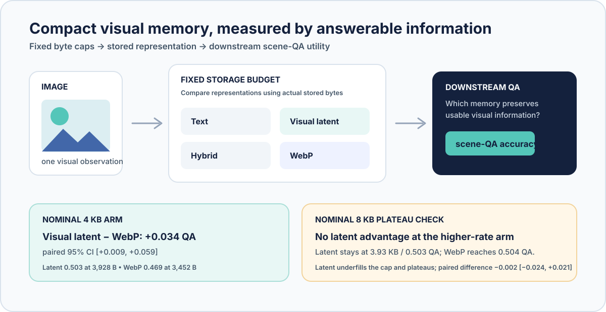
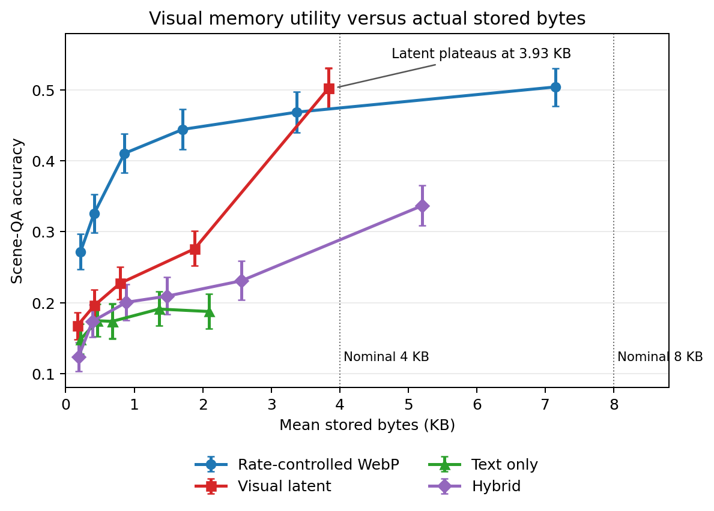

<div align="center">


# Visual Memory Codec

### What should a multimodal system remember when every stored byte counts?

*A frozen benchmark of compact visual memories, evaluated by the information a vision–language model can recover—not by pixel similarity alone.*

[**Teaser**](#the-result-at-a-glance) · [**Frozen results**](results/formal_benchmark/README.md) · [**Key-results CSV**](paper_assets/table_1_key_results.csv) · [**Reproduce the figure**](#inspect-or-reproduce)

</div>

Visual Memory Codec asks a concrete systems question: after an image becomes a
small persistent memory, which representation preserves the information needed
for downstream visual question answering? The frozen N=288 study compares
text-only, visual-latent, hybrid, and rate-controlled WebP memories under
exact per-image byte accounting.

> [!TIP]
> **Key takeaways**
>
> - The benchmark asks which compact memory leaves a vision–language model
>   best able to answer questions about an image under an explicit byte budget.
> - At the nominal **4 KB** arm, visual latent memory exceeds WebP by **+0.034
>   scene-QA** (paired 95% CI **[+0.009, +0.059]**) under the canonical evaluator.
> - The effect is modest and evaluator-sensitive: it is not strict
>   evaluator-robust, and it disappears at 8 KB as the latent memory underfills
>   the cap and plateaus at 3.93 KB.

## The result at a glance



*Visual summary. All representations are evaluated by downstream QA under
stored-byte caps. The stated contrasts and actual rates are taken directly from
the frozen aggregate and paired-comparison tables.*

<details>
<summary>Show the full rate–QA figure</summary>



*Figure 1. Scene-QA accuracy versus **actual mean stored bytes**. Error bars
are 95% image-bootstrap intervals; vertical guides mark nominal 4 KB and 8 KB
arms. The x-axis uses actual bytes throughout, not a nominal budget label.*

</details>

| Frozen finding | Evidence | Scope-correct interpretation |
|:--|:--|:--|
| **4 KB canonical contrast** | Latent: 0.503 QA at 3,928 B; WebP: 0.469 at 3,452 B | Positive paired contrast (+0.034, 95% CI [+0.009, +0.059]); actual rates are not identical. |
| **8 KB plateau check** | Latent stays at 3,928 B / 0.503; WebP reaches 7,320 B / 0.504 | No latent advantage at this arm; latent underfills its cap rather than reaching a higher ceiling. |
| **Second evaluator (Control A)** | 4 KB contrast: +0.0217, CI [0.0000, +0.0425] | Direction remains positive, but the strict evaluator-robustness rule is **not met** because the interval touches zero. |
| **Text encoder (Control B)** | Frozen N=144 subset, Qwen2.5-VL-7B text encoder | No paired confidence interval excludes zero: no clear encoder-capacity effect. |

The compact [machine-readable result table](paper_assets/table_1_key_results.csv)
contains these predeclared contrasts and control summaries.

## Why this benchmark

Visual-memory methods are often compared by nominal file size or image quality.
That does not directly answer whether a downstream model can use the stored
state. This benchmark measures question-answering recovery from the memory
representation while recording the actual bytes consumed for every image and
method.

The aim is not to crown a universally better image codec. It is to make the
trade-off between compact representation and usable visual information
measurable under one explicit, reproducible protocol.

## What the frozen study covers

| Component | Frozen design |
|:--|:--|
| Benchmark | 288 GQA/Visual Genome images; 1,152 questions across six functional groups |
| Memories | Text only, visual latent, hybrid, rate-controlled WebP; AVIF where feasible; unbudgeted raw-image oracle |
| Nominal caps | 256 B, 512 B, 1 KB, 2 KB, 4 KB, and 8 KB—with actual stored-byte accounting |
| Primary inference | 10,000-resample paired image bootstrap for method contrasts |
| Manifest | SHA-256 `2cd66fcc014c97c51cb07e58407f9aa43e8f124bb59224146ed8b745a407f12e` |

## Main findings

- **At nominal 4 KB**, visual latent memory has the positive canonical
  latent-minus-WebP contrast above. Text-only and hybrid memories do not match
  WebP at the reported 4 KB or 8 KB arms.
- **At nominal 8 KB**, latent remains at 3,928 mean bytes and 0.503 QA, while
  WebP reaches 7,320 bytes and 0.504 QA. The paired difference is −0.002
  (95% CI [−0.024, +0.021]).
- **The raw-image oracle is 0.539 QA** under the canonical evaluator. It is a
  reference point for this evaluator and manifest, not a human-perceived
  fidelity ceiling.

For the complete analysis, including functional-group results and the
predeclared comparisons, see the [formal N=288 analysis](docs/formal_n288_analysis.md).

## Robustness controls

Two controls were specified before execution; neither changes the frozen
canonical benchmark.

| Control | Only intentional change | Result |
|:--|:--|:--|
| **A — evaluator robustness** | Re-evaluate the exact latent, WebP, and raw-oracle artifacts with Qwen2.5-VL-7B | Positive 4 KB point estimate, but CI touches zero; the frozen strict evaluator-robustness criterion is not satisfied. See the [evaluator report](docs/evaluator_robustness.md). |
| **B — text-encoder capacity** | Replace only the text encoder with Qwen2.5-VL-7B on a deterministic balanced N=144 subset | No clear capacity effect. This control does **not** test, strengthen, or overturn the latent-versus-WebP contrast. See the [text-encoder report](docs/text_encoder_robustness.md). |

The [frozen robustness protocol](docs/robustness_protocol.md) records the
decision rules and guardrails used for both controls.

## Limits on interpretation

- These measurements are specific to the frozen GQA/Visual Genome manifest and
  vision–language evaluation pipeline; they are **not** claims about general
  human-perceived image fidelity.
- Nominal budget arms can have different actual rates. At 4 KB, the latent
  representation uses 476 more mean bytes than WebP; at 8 KB it is a
  lower-rate plateau.
- The raw-image oracle is 0.539 QA under the canonical evaluator and 0.507
  under Control A, limiting absolute interpretation of every reported score.
- Control A uses a second evaluator in the Qwen2.5-VL family, not an
  independent evaluator family.

## Repository guide

```text
paper_assets/                 Main figure and compact key-results CSV
configs/                      Frozen benchmark and robustness configurations
docs/                         Analysis, protocol, robustness reports, limitations
results/formal_benchmark/     Curated tables and platform-independent provenance
scripts/                      Benchmark entry points and figure generator
src/visual_memory_benchmark/  Reusable benchmark implementation
```

Start with the [frozen results bundle](results/formal_benchmark/README.md) for
the manifest, curated outputs, and provenance pointers.

## Inspect or reproduce

The results are frozen. This release includes the code, configurations, figure
generator, and compact tables necessary to inspect the published measurements.
Raw source images, model weights, encoded payloads, and execution environments
are intentionally not redistributed.

Regenerate the tracked figure from the frozen canonical aggregate table:

```bash
PYTHONPATH=src python3 scripts/generate_release_artifacts.py
```

Run the lightweight synthetic regression benchmark:

```bash
PYTHONPATH=src python3 -m visual_memory_benchmark.run --config configs/synthetic_baseline.json
```

For the full record, read the [formal analysis](docs/formal_n288_analysis.md),
[frozen protocol](docs/robustness_protocol.md), and [result bundle](results/formal_benchmark/README.md).
Credentials, model caches, raw images, remote execution state, local research
notes, and temporary outputs remain deliberately untracked.
